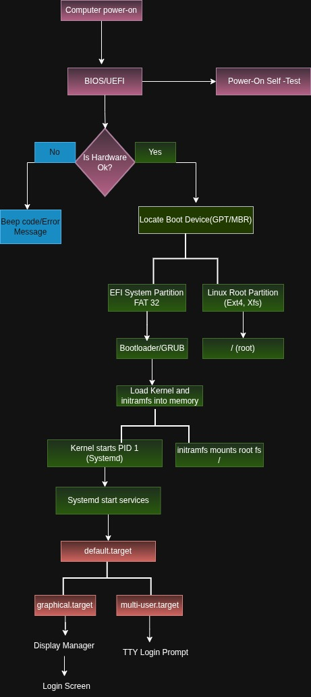

## Linux Boot Process

The following diagram illustrates the complete Linux boot sequence from power-on to the login prompt.

### Boot Sequence

- Computer powers on.
- BIOS/UEFI performs POST.
- Firmware locates the boot device.
- GRUB loads the Linux kernel and initramfs.
- initramfs mounts the root filesystem.
- The kernel starts PID 1 (systemd).
- systemd launches services and reaches the configured target.
- The system presents either a graphical login or a TTY login prompt.
